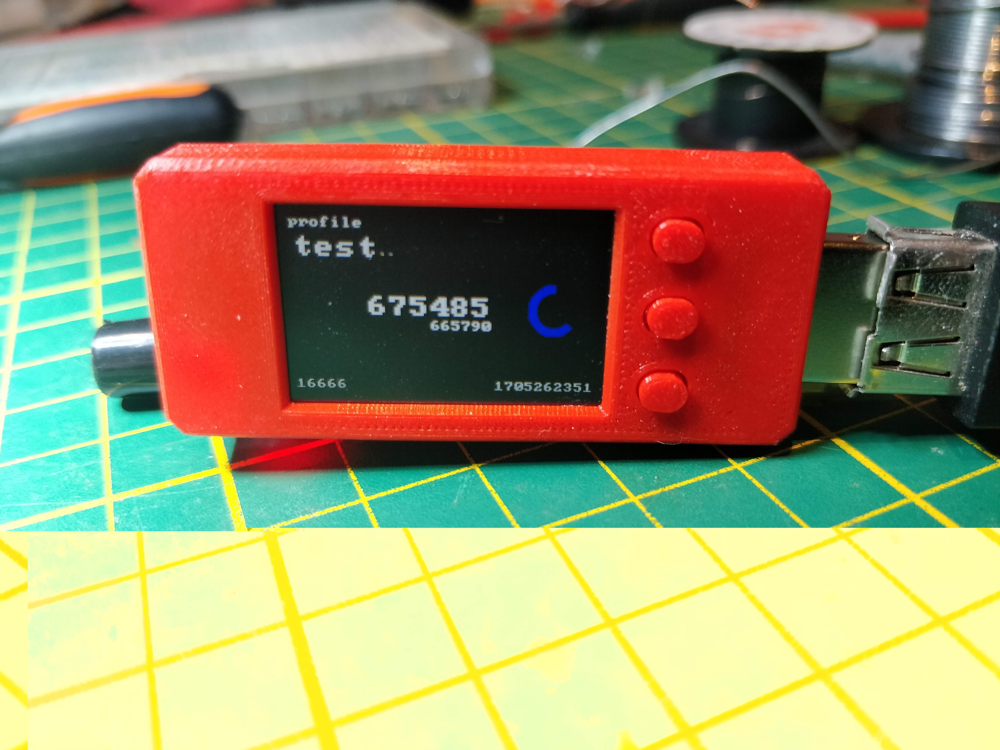
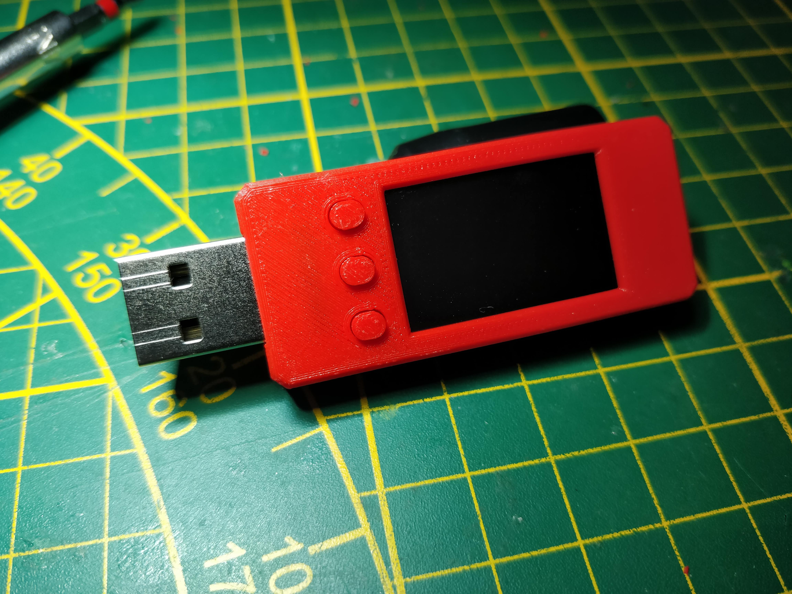
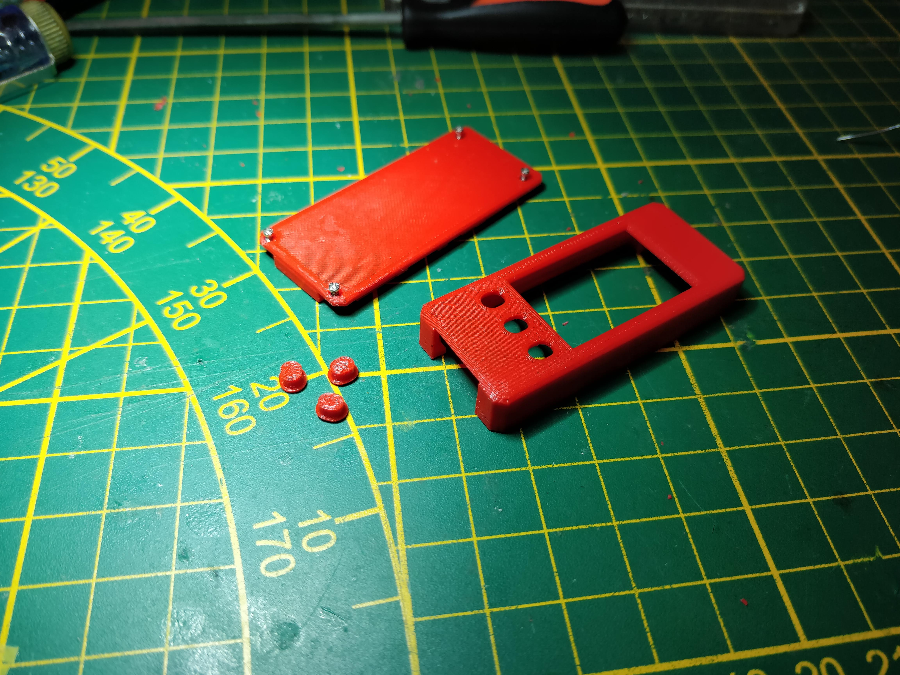
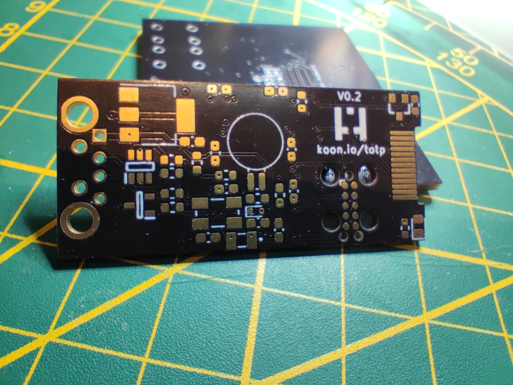
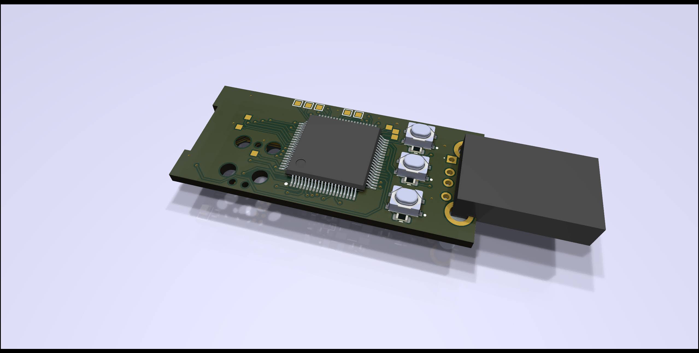
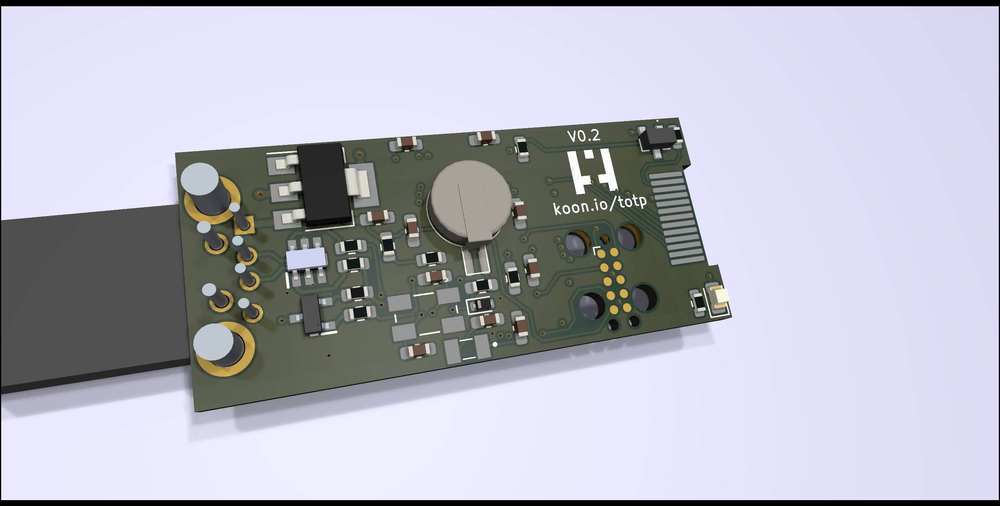

## Hardware TOTP token
Open source hardware TOTP token. Currently targets the LPC1756, LPC1758 and LPC1759 (with a small change it should also run on the LPC1754). 

The LPC1756 does not have enough ram to hold a full framebuffer (240 * 135 * 2 = 64'800 bytes). To work around this issue, we use 2 smaller framebuffers we alternate between. While one framebuffer is being transferred to the screen using DMA we fill the other.

To make it easier (for me) the whole screen is written to this smaller framebuffer. The pixels that do not fit the framebuffer are thrown away. This does waste CPU cycles but is not limiting the framerate. Filling a full frame with pixels takes around 6 milliseconds. Writing a full frame of framebuffers takes around 11 milliseconds. This limits the maximum framerate to ≈ 85FPS. To get a consistant frame rate there is a limit of 60FPS.

The main screen takes the longest to draw. This is caused by the amount of pixels of the circle it needs to draw. The circle is generated on compile time to work around that the LPC175x family does not have a FPU. These generated pixels use 8640 bytes of flash.

### Features
* keys never leave the token after setup
* enter button types 6 digit key using HID keyboard (any device that supports HID keyboards should work)
* supports up to 32 profiles
* rechargable RTC battery
* USB mode to add/delete profiles using a CSV file
* support to change the RTC calibration values in the settings
* support for setting the time
* 60 seconds screen timeout
* Support for timezones

### Images
Photos 

PCB 

More pictures can be found [here](./img/)

### TODO
* encrypt profiles
* support for base32 keys
* support for different intervals
* support for 8 digit keys
* add support for more than 32 profiles (needs a rework if more profiles are required. The profiles are copied to ram and there is not enough for more at the moment. If we leave them in flash we can store a lot more)
* rework the calibration and time settings screens

### Compiling
TOTP uses [klib](https://github.com/itzandroidtab/klib). This repo can be cloned in the klib project folder. See [build.yml](./.github/workflows/build.yml) for more info on compiling this project.

### Extra
Is intended to be used with [USB dfu bootloader](https://github.com/itzandroidtab/dfu_bootloader). To build without bootloader support delete `set(TARGET_LINKERSCRIPT ...)` from the `CMakeLists.txt` in this project.
